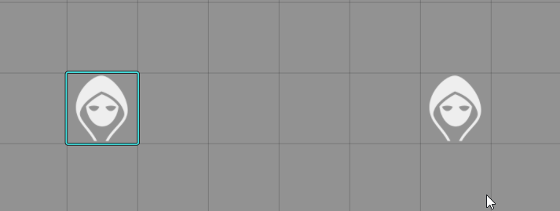
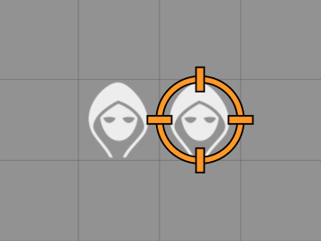
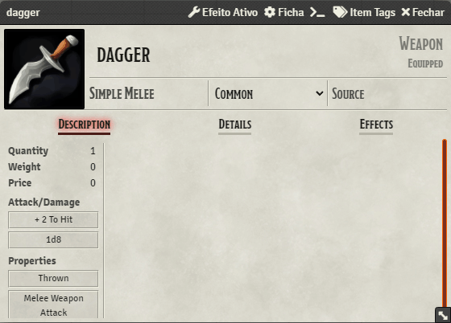

A Foundry VTT module that provides automation and effects for many items and spells

## Missed projectiles are transformed into Item Piles

## Powerful impacts shake the screen

## Settings
Almost eveything in the module can be fine tuned to your desire, if there is something you want to be configured/added to the module leave a issue :)

## How to start
Currently, only single hit melee and ranged animations are supported. You also need to have JB2A Patreon animation collection to use the module.

#### These are the currently supported tags:
- Melee
  -  club
  -  dagger
  -  falchion
  -  glaive
  -  greataxe
  -  greatclub
  -  greatsword
  -  halberd
  -  hammer
  -  javelin
  -  kunai
  -  handaxe
  -  mace
  -  maul (has a powerful impact)
  -  quarterstaff
  -  rapier
  -  scimitar
  -  shortsword
  -  spear
  -  sword
  -  warhammer
  -  wrench
- Ranged
  - shortbow
  - longbow
  - handcrossbow
  - lightcrossbow
  - heavycrossbow

## Planned
- User defined tags and animations
- Better default animations
- Better elevation sensor for Item Piles
- Item Piles custom images support (arrow with transparent background)
- More default animations
- Death effect
- Lighting tags (torch, lamp, etc)
- Option to configure percentage of ranged and thrown items that get destroyed on impact
- Sounds
- Unique magical items
- Spells interactions with the world